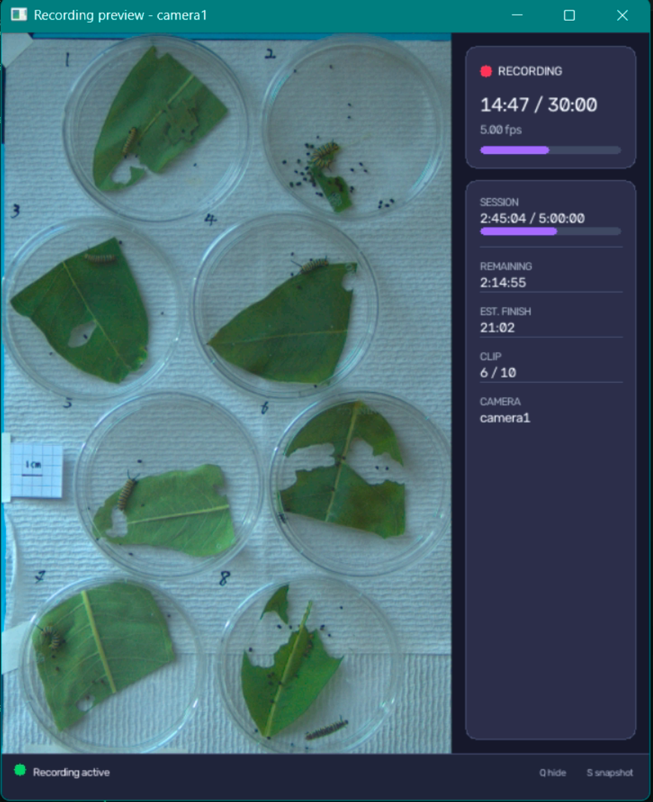

# Basler caterpillar recorder

This repository documents and drives the current one-camera recording workflow for the Basler `a2A1920-160ucBAS` camera with serial `40604036` and YAML label `camera1`.



The recorder supports:

- setup preview that does not record;
- lightweight recording preview with clip/session progress;
- terminal `STATUS` heartbeats while waiting and recording;
- local-first clip writing;
- verified archive transfer with `.incoming/*.partial` promotion;
- `rsync` on macOS/Linux and `robocopy` on Windows;
- SHA-256 verification before local clip deletion;
- built-in sleep prevention for unattended runs.

If you use a different camera, copy a YAML template and update the model, serial, frame size, and rotation before recording.

## At a glance

- `record_basler.py` is the main CLI for listing cameras, previewing, dry runs, and scheduled recording.
- `validate_session.py` checks clip structure, JSON sidecars, timing, and archive state.
- `prepare_cropped_timestamps.py` copies one authoritative timestamp sidecar per raw source clip into `cropped_by_caterpillar/timestamps/` and writes `crop_manifest.csv`.
- `analysis_timing.py` holds the shared UTC/timestamp parsing helpers used by the analysis scripts.
- `extract_motion_energy.py` builds cached per-crop motion traces, a consolidated `motion_energy_timeseries.csv`, editable thresholds, diagnostics, and `motion_states.csv`.
- `analyze_leaf_feeding.py` derives coarse 5-minute leaf-area proxy traces and automatic feeding bouts from the same `crop_manifest.csv` plus copied timestamp sidecars, using sparse frame seeks instead of decoding every frame.
- `plot_recording_timeline.py` builds `recording_coverage.csv` and `recording_behavior_timeline.png` from timestamp sidecars, behavior events, optional motion states, optional feeding events, and an optional quantitative motion panel.
- `test_record_basler.py` covers schedule math, preview sizing, JSON handling, and archive helpers.
- `config_smoke_test.yaml` is a short local test.
- `config_multiclip_smoke_test.yaml` is a short repeated-clip test.
- `config_archive_smoke_test.yaml` is a three-clip archive test.
- `config_windows_test.yaml` is a Windows-local test template.
- `config_windows_long_recording.yaml` is a long-run template, not a fixed-duration promise.
- `config_pilot.yaml` is the main pilot template.
- `QUICKSTART.md` is the short daily checklist after setup is already complete.

The tracked YAML files are templates. Copy one to a local file such as `config_local_macos.yaml` or `config_local_windows.yaml` before you edit it. Git ignores `config_local*.yaml`.

## Quick motion-energy analysis for cropped caterpillar videos

This workflow adds a fast motion-derived mobile/immobile proxy while pose estimation is still pending. It is useful for quick inspection, but it is not ground-truth behavior classification.

Important guardrails:

- raw per-frame timestamp sidecars remain the authoritative scientific time source;
- the flat `cropped_by_caterpillar/*.mp4` layout stays unchanged;
- one copied timestamp file is shared by all C01-C08 crops from the same raw source clip;
- only explicit `motion_states.csv` intervals are rendered as motion-derived mobile or immobile; unfilled time stays unknown.

Typical workflow on Windows:

```powershell
python prepare_cropped_timestamps.py `
  "D:\Hung_MBL\monarch_behavior_windows\new_cohort_C01-C08"
```

This creates:

```text
cropped_by_caterpillar/
    crop_manifest.csv
    timestamps/
```

Smoke-test one animal and a couple of clips first:

```powershell
python extract_motion_energy.py `
  "D:\Hung_MBL\monarch_behavior_windows\new_cohort_C01-C08" `
  --animals C01 `
  --limit-clips 2
```

Then run the full motion extraction:

```powershell
python extract_motion_energy.py `
  "D:\Hung_MBL\monarch_behavior_windows\new_cohort_C01-C08"
```

This writes:

```text
cropped_by_caterpillar/motion_energy/
    traces/
    motion_energy_timeseries.csv
    motion_thresholds.csv
    motion_summary.csv
    motion_states.csv
    motion_energy_diagnostics.png
```

If you want to tune thresholds, edit only the `threshold` values in `motion_thresholds.csv`, then regenerate states without decoding video again:

```powershell
python extract_motion_energy.py `
  "D:\Hung_MBL\monarch_behavior_windows\new_cohort_C01-C08" `
  --classify-only
```

`plot_recording_timeline.py` now auto-detects `cropped_by_caterpillar/motion_energy/motion_states.csv` when it exists, so this is usually enough:

```powershell
python plot_recording_timeline.py `
  "D:\Hung_MBL\monarch_behavior_windows\new_cohort_C01-C08" `
  --events "D:\Hung_MBL\monarch_behavior_windows\new_cohort_C01-C08\animal_event_log.csv"
```

`--events` can also point directly at a Google Sheet tab URL. The plotting machine must be able to read that sheet without interactive login, for example with an "Anyone with the link - Viewer" share setting.

```powershell
python plot_recording_timeline.py `
  "D:\Hung_MBL\monarch_behavior_windows\new_cohort_C01-C08" `
  --events "https://docs.google.com/spreadsheets/d/1yqe8VII3YNzX2EmOlbBckgTCJKXD47PLZEfHeO2yQ2w/edit?gid=1696022641#gid=1696022641"
```

Each successful Google Sheet fetch saves the exact CSV used for the plot to:

```text
behavior_events_used.csv
behavior_events_source.json
```

This keeps the plot reproducible even though the live sheet can change between runs.

To mark an experiment-wide interval instead of a single animal row, set `animal_id` to `All`, `Global`, or `*`. For example:

```text
animal_id,start_local,end_local,event,kind,notes
All,2026-08-09 15:00:00,2026-08-09 15:30:00,video_quality_low,video_quality,brief focus drift
```

These global intervals draw as background spans across both the recording coverage panel and all animal rows. Only the two supported global types are rendered on the plot: `video_quality` spans, including aliases such as `video_quality_low`, `poor_video_quality`, `bad_video_quality`, `bad_lighting`, and `poor_lighting`, and `food_unavailable` spans. Other global annotations stay in the event log and snapshot CSV, but they are not drawn on the timeline. During low-video-quality intervals, motion-derived mobile/immobile bands are intentionally omitted from the plot so that the interval reads as unknown rather than trusted classifier output. Global rows must include both `start_local` and `end_local`.

If you want to point at a specific motion-state file explicitly:

```powershell
python plot_recording_timeline.py `
  "D:\Hung_MBL\monarch_behavior_windows\new_cohort_C01-C08" `
  --events "D:\Hung_MBL\monarch_behavior_windows\new_cohort_C01-C08\animal_event_log.csv" `
  --motion-states "D:\Hung_MBL\monarch_behavior_windows\new_cohort_C01-C08\cropped_by_caterpillar\motion_energy\motion_states.csv"
```

Leaf-area feeding analysis reuses the same `crop_manifest.csv` and copied timestamp files, so motion and feeding stay aligned to the same authoritative UTC timing:

```powershell
python analyze_leaf_feeding.py `
  "D:\Hung_MBL\monarch_behavior_windows\new_cohort_C01-C08"
```

This writes:

```text
cropped_by_caterpillar/leaf_feeding/
    leaf_area_timeseries.csv
    feeding_events.csv
    leaf_feeding_summary.csv
    qc/
```

The current feeding detector is intentionally coarse:

- it estimates leaf area every 5 minutes on an absolute UTC grid;
- each estimate uses a sparse 1-minute burst of frames for occlusion robustness;
- feeding is classified from consecutive 5-minute absolute leaf-area loss, not percent loss;
- `video_quality_low` event intervals invalidate feeding detection while still leaving the QC trace visible.

By default, `analyze_leaf_feeding.py` and `plot_recording_timeline.py` now resolve the event source in this order: explicit `--events`, saved Google Sheet metadata in `behavior_events_source.json`, local `animal_event_log.csv`, then local `behavior_events.csv`. This keeps leaf resets and global bad-video intervals consistent with the main timeline while still letting you override the source explicitly.

To overlay those automatic feeding bouts on the main timeline without changing your manual event log:

```powershell
python plot_recording_timeline.py `
  "D:\Hung_MBL\monarch_behavior_windows\new_cohort_C01-C08" `
  --events "D:\Hung_MBL\monarch_behavior_windows\new_cohort_C01-C08\animal_event_log.csv" `
  --feeding-events "D:\Hung_MBL\monarch_behavior_windows\new_cohort_C01-C08\cropped_by_caterpillar\leaf_feeding\feeding_events.csv" `
  --motion-energy "D:\Hung_MBL\monarch_behavior_windows\new_cohort_C01-C08\cropped_by_caterpillar\motion_energy\motion_energy_timeseries.csv"
```

`plot_recording_timeline.py` now accepts either legacy `start_local` / `end_local` fields or UTC-canonical `start_utc` / `end_utc` fields in event CSVs. Automatic feeding events use the same interval bar renderer as manual feeding annotations, so short feeding bouts stay bars instead of turning into point markers. Semantic point events are rendered explicitly: shed / molt as a triangle, electrical stimulation as a red `⚡`, and death as an `X`. Generic point observations are kept in the event source but are not drawn on the timeline.

## New computer workflow

1. Install Basler pylon, FFmpeg, Git, and `uv`.
2. Clone this repository.
3. Create the repository `.venv`.
4. Confirm the camera appears in pylon Viewer.
5. Run `--list-cameras`.
6. Copy a YAML template to a local config.
7. Run `--dry-run`.
8. Run `--preview camera1`.
9. Run a short local recording test.
10. Run a three-clip archive smoke test.
11. Validate the session.
12. Only then start the long unattended run.

Do not begin with the long-run template on a new computer.

## Hardware and system setup

Keep the computer on AC power, leave the lid open unless the OS is explicitly configured otherwise, and connect the camera directly to USB 3 when possible. Avoid USB hubs if you can.

### Camera

Install Basler pylon and confirm the camera is visible in pylon Viewer before you record anything.

For the main camera, the expected values are:

```text
model:  a2A1920-160ucBAS
serial: 40604036
label:  camera1
```

### Recording computer

- Keep enough free space on the internal recording disk.
- Mount the external archive drive before archive-enabled runs.
- Do not mix Conda/Anaconda with the repository `.venv` unless you have a specific reason to do so.

## Install software

Use `uv` with the existing `requirements.txt` workflow:

```bash
uv python install 3.12
uv venv --python 3.12
source .venv/bin/activate
uv pip install -r requirements.txt
```

On Windows PowerShell:

```powershell
uv python install 3.12
uv venv --python 3.12
.venv\Scripts\Activate.ps1
uv pip install -r requirements.txt
```

If PowerShell blocks activation, run:

```powershell
Set-ExecutionPolicy -Scope CurrentUser RemoteSigned
```

Verify the install with:

```bash
python --version
python -c "import pypylon; print('pypylon OK')"
python -c "import cv2; print('OpenCV', cv2.__version__)"
ffmpeg -version
```

## Confirm the camera

List connected cameras:

```bash
python record_basler.py --list-cameras
```

If the serial differs, update your copied YAML before you continue.

If no camera appears:

1. Confirm it appears in pylon Viewer.
2. Reconnect the USB cable.
3. Try a direct USB 3 port.
4. Close any app already using the camera.
5. Run `--list-cameras` again.

## Create a run-specific config

Copy a template first.

Windows:

```powershell
Copy-Item config_windows_long_recording.yaml config_local_windows.yaml
```

macOS:

```bash
cp config_pilot.yaml config_local_macos.yaml
```

Before every experiment, review:

```yaml
project:
subject:

experiment:
  animal_ids:
  notes:

output_root:

schedule:
  # Optional one-shot local start. Remove or leave null for immediate start.
  # start_at_local: "YYYY-MM-DD HH:MM"
  clip_duration_s:
  interval_s:
  number_of_clips:
  # or total_duration_h:

cameras:
  - model:
    serial:
    fps:
    width:
    height:
    auto_exposure:
    auto_exposure_lower_us:
    auto_exposure_upper_us:
    auto_target_brightness:
    auto_gain:
    balance_white_auto:
    exposure_us:
    gain:
    rotate:

archive:
  enabled:
  destination_root:
  required_mount_point:
```

For the main camera, the current full-field config uses:

```yaml
model: a2A1920-160ucBAS
serial: "40604036"
fps: 5
width: 1920
height: 1200
offset_x: 0
offset_y: 0
rotate: 270
```

`rotate: 270` means 90 degrees counter-clockwise.

Bounded continuous auto exposure and continuous white balance for the current caterpillar setup look like:

```yaml
exposure_us: 30000
gain: 0
auto_exposure: true
auto_exposure_mode: continuous
auto_exposure_lower_us: 6000
auto_exposure_upper_us: 180000
auto_target_brightness: 0.70
auto_exposure_roi: full
auto_gain: false
balance_white_auto: true
```

Keep these warnings in mind:

- Continuous auto exposure changes exposure during recording.
- Continuous white balance changes color balance during recording.
- Keep `auto_gain: false` and `gain: 0` for this experiment.
- `auto_exposure_upper_us` must stay below the frame period.
- At 5 Hz, use `180000 us`, not the full `200000 us`.
- `auto_target_brightness: 0.70` is the current empirically tuned target for the MBL dish/leaf scene, not an exact guarantee.
- Do not treat raw RGB values or intensity as calibrated measurements while either auto exposure or white balance is enabled.
- Run a blocked-light test before unattended recording.

### Why continuous white balance is enabled

The caterpillar recording arena is in an open lab space next to a large window. Illumination changes substantially during long recordings as daylight, room lighting, and IR illumination contribute different amounts of light.

The main goal is behavioral tracking and pose estimation, not quantitative color or pixel-intensity measurement. Therefore continuous white balance is intentionally enabled:

```yaml
balance_white_auto: true
```

This maps to Basler `BalanceWhiteAuto=Continuous`.

The camera may adjust RGB balance while frames are being acquired so that the caterpillars and background remain visually usable as illumination changes.

This is a deliberate tradeoff:

- preferred: visually consistent, trackable video across changing light;
- not guaranteed: fixed RGB gains or photometrically calibrated color.

The raw videos should not be treated as calibrated measurements of absolute color or intensity without accounting for the automatic camera controls.

The recorder also explicitly disables the opposite auto-function assignment on each ROI/AOI where supported, so stale pylon Viewer settings cannot cause brightness and white balance to share unintended regions.

## Schedule meaning

The recorder now has two scheduling layers:

- Initial start: immediate by default, or optional `schedule.start_at_local` in this computer's local timezone.
- Clip schedule: `clip_duration_s`, `interval_s`, and `total_duration_h` or `number_of_clips`.

Use the values in the YAML to understand the planned span after recording starts.

When a schedule is limited by `number_of_clips`, the nominal span is:

```text
(N - 1) * interval + clip duration
```

When `clip_duration_s` equals `interval_s`, the run is near-continuous with a small clip-boundary overhead.

Do not treat the long-run template as an exact-duration promise. Inspect `clip_duration_s`, `interval_s`, `number_of_clips`, and `total_duration_h` in the copied config you actually plan to use.

One-shot scheduled starts must include both date and time, for example:

```yaml
schedule:
  start_at_local: "2026-09-01 05:00"
  clip_duration_s: 1800
  interval_s: 1800
  total_duration_h: 24
```

Supported `start_at_local` formats are:

- `YYYY-MM-DD HH:MM`
- `YYYY-MM-DD HH:MM:SS`

Important scheduler rules:

- Omit `start_at_local` or set it to `null` for the normal immediate-start behavior.
- The value is interpreted in the recording computer's local timezone.
- A clock-only value such as `"05:00"` is rejected.
- A past scheduled time is rejected instead of silently starting immediately.
- In scheduled mode, the recorder waits first and only creates the real session directory when the scheduled start is reached.

Remove or comment `start_at_local` after that experiment if you want the next invocation to start immediately.

## Time And Timestamp Policy

The recorder uses three kinds of time for different purposes:

| Purpose | Time source |
|---|---|
| Folder names, terminal logs, preview, and finish-time display | Local computer time with a numeric UTC offset |
| Scientific metadata and cross-computer alignment | UTC |
| Elapsed time, clip scheduling, and heartbeat timing | Monotonic clock |

A new session folder may look like:

```text
20260804_105301-0400
```

This means the session was created at local time `10:53:01` with UTC offset `-04:00`.

A clip folder may look like:

```text
clip_0000_105302-0400
```

UTC remains the canonical timestamp in JSON metadata and frame timestamp files. Important metadata events also include a human-readable local-time mirror, for example:

```json
{
  "session_start_utc": "2026-08-04T14:53:01.254Z",
  "session_start_local": "2026-08-04T10:53:01.254-04:00"
}
```

The per-frame timestamp file does not repeat a formatted local-time string for every frame. Use `host_utc_ns` for absolute timing and `host_monotonic_ns` or `elapsed_s` for intervals.

Local time is used for operator convenience, but UTC is retained because it is unambiguous across computers, time zones, and daylight-saving transitions.

Older sessions may use UTC-looking folder names without an offset, such as:

```text
20260804_145301
```

The validator and analysis tools continue to support those legacy names.

## Check archive settings

Example Windows archive config:

```yaml
archive:
  enabled: true
  backend: auto
  destination_root: "D:/Hung_MBL"
  required_mount_point: "D:/"
```

Use forward slashes in Windows YAML paths.

`backend: auto` selects `robocopy` on Windows.

Example macOS archive config:

```yaml
archive:
  enabled: true
  backend: auto
  destination_root: "/Volumes/Dr. Rose/Hung_MBL"
  required_mount_point: "/Volumes/Dr. Rose"
```

`backend: auto` selects `rsync` on macOS/Linux.

Archive transfer is local-first:

1. record the clip locally;
2. copy it to `.incoming/<clip>.partial`;
3. compare file names, sizes, and SHA-256 hashes;
4. promote the verified partial directory to the final visible clip directory;
5. delete the local clip only after verification passes.

If transfer fails, the local clip is preserved. Do not manually delete `.incoming/*.partial` until you have inspected the failure.

## Dry run

A dry run checks config, schedule, paths, archive backend, mount point, executables, and free space without opening the camera.

If `schedule.start_at_local` is set, the dry run validates the requested future local start time and reports the planned start and finish, but it does not enter the scheduled wait.

Windows:

```powershell
python record_basler.py --config config_local_windows.yaml --dry-run
```

macOS:

```bash
python record_basler.py --config config_local_macos.yaml --dry-run
```

Do not continue if the dry run reports a failure.

For a scheduled overnight macOS run, the recommended sequence is:

```bash
python record_basler.py --config config_local_macos.yaml --dry-run
caffeinate -i python record_basler.py --config config_local_macos.yaml
```

During an actual scheduled wait, the recorder:

- performs pre-arm FFmpeg / camera / archive checks before waiting;
- prints periodic `STATUS` heartbeats until the requested start;
- repeats critical checks again at the scheduled start before opening cameras;
- keeps built-in sleep prevention active during the wait when `system.prevent_sleep_during_recording: true`.

Pressing `Ctrl+C` during the scheduled waiting phase cancels the run cleanly before recording starts.

## Setup preview

Windows:

```powershell
python record_basler.py --config config_local_windows.yaml --preview camera1
```

macOS:

```bash
python record_basler.py --config config_local_macos.yaml --preview camera1
```

`--preview` is preview-only and does not record.

Setup-preview controls:

```text
q or Escape   close preview
s             save a full processed snapshot
p             print camera settings
```

Confirm the full field of view, focus, brightness, rotation, and reflection control before you proceed.

Preview sizing is independent of saved-video resolution. Reducing the preview width or height does not downsample the recorded MP4.

## Recording preview during acquisition

If you want a lightweight monitor window during recording, add:

```yaml
recording_preview:
  enabled: true
  fps: 1
  max_width: 600
  max_height: 720
  show_status: true
  layout: card_panel
```

### Recording window

The `card_panel` layout keeps the camera image unobstructed while showing clip and session progress, measured receive FPS, current exposure, estimated finish time, and recording status.


During recording:

- the preview is display-only;
- the preview shows clip and session progress;
- the terminal prints periodic `STATUS` heartbeats;
- `q` hides the recording preview for the current clip without stopping acquisition; the preview reopens at the next clip;
- `s` saves the raw preview frame without the panel or footer into the clip directory;
- `Ctrl+C` stops the recording cleanly.

### Stopping a recording safely

Press `Ctrl+C` once to stop recording gracefully.

If a clip is currently being recorded, the recorder stops acquisition after the current frame, finalizes the partial MP4 and timestamp sidecar, and marks the clip as intentionally incomplete. On Windows, the recorder isolates FFmpeg from console `Ctrl+C` events so Python handles the stop request and then closes FFmpeg through its stdin pipe for a clean partial-clip finalize. When archiving is enabled, the partial clip is queued for archive and verified before the program exits.

The interrupted clip is preserved but is not counted as a fully completed scheduled clip.

After pressing `Ctrl+C`, keep the terminal open until the recorder reports that pending archive transfers have finished.

Supported layouts:

- `card_panel`: appends a right-side information panel and bottom status footer while keeping the camera image unobstructed.
- `legacy_overlay`: uses the older translucent text overlay on top of the preview image.

The preview-enabled example configs are:

- `config_experiment_day1.yaml`
- `config_multiclip_smoke_test.yaml`
- `config_archive_smoke_test.yaml`

## Run a local recording test

On a new computer, first disable archive in your copied config:

```yaml
archive:
  enabled: false
```

Use a short schedule:

```yaml
schedule:
  clip_duration_s: 10
  interval_s: 10
  number_of_clips: 1
```

Run the short test:

```powershell
python record_basler.py --config config_local_windows.yaml
```

or:

```bash
python record_basler.py --config config_local_macos.yaml
```

Confirm the session contains the expected clip directory, MP4, timestamps, JSON metadata, and log files.

New session and clip folders use local time plus a numeric UTC offset. Older sessions may use the legacy timestamp format without an offset.

## Run the archive smoke test

With the archive drive mounted, run:

```bash
caffeinate -i python record_basler.py --config config_archive_smoke_test.yaml
```

On macOS, `caffeinate -i` is still useful if you want sleep prevention outside the YAML.

Validate the generated session:

```bash
python validate_session.py SESSION_PATH
```

Replace `SESSION_PATH` with the actual session directory you want to check.

Example macOS command to find the newest session and validate it:

```bash
SESSION_PATH=$(find recordings -name session_summary.json -print0 | xargs -0 -n1 dirname | sort | tail -n 1)
python validate_session.py "$SESSION_PATH"
```

Example Windows PowerShell command:

```powershell
$session = Get-ChildItem recordings -Recurse -Filter session_summary.json | Sort-Object LastWriteTime | Select-Object -Last 1
if ($session) { $session = Split-Path $session.FullName -Parent }
python validate_session.py $session
```

`PASS` should be a prerequisite before you rely on unattended long runs on a new setup.

## Start a long run

The long-run template is meant to be reviewed and copied locally before use. Do not assume its duration is still the same after you edit it.

Windows example:

```powershell
python record_basler.py --config config_local_windows.yaml --dry-run
python record_basler.py --config config_local_windows.yaml
```

macOS example:

```bash
python record_basler.py --config config_local_macos.yaml --dry-run
caffeinate -i python record_basler.py --config config_local_macos.yaml
```

For unattended recording, keep the machine on power, leave the lid open if needed, and stop cleanly with `Ctrl+C`.

## Storage check before the long run

Do not rely on a fixed compression estimate. Run a short test first, inspect the MP4 size, and extrapolate from what you actually recorded.

The archive workflow keeps active clips on the local SSD only until verification succeeds, so protect the internal recording disk and mount the external archive drive before you begin.
